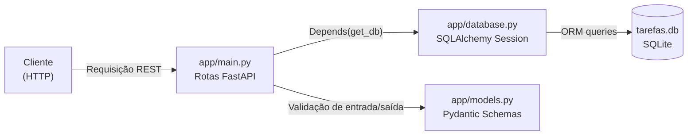
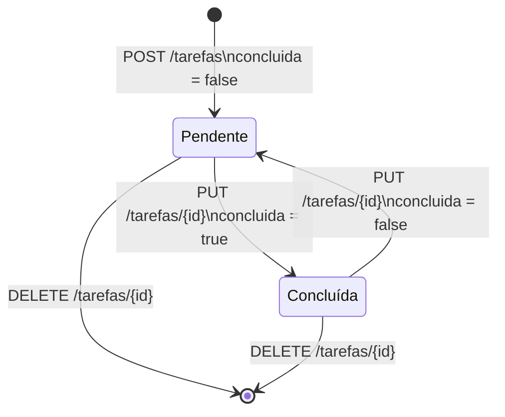
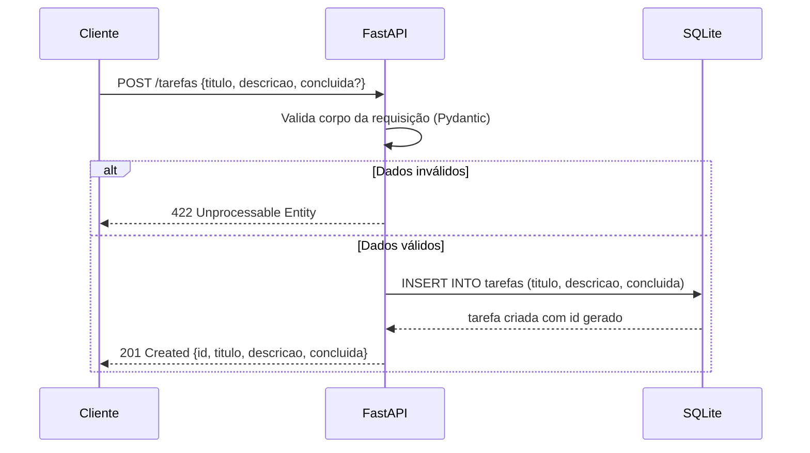
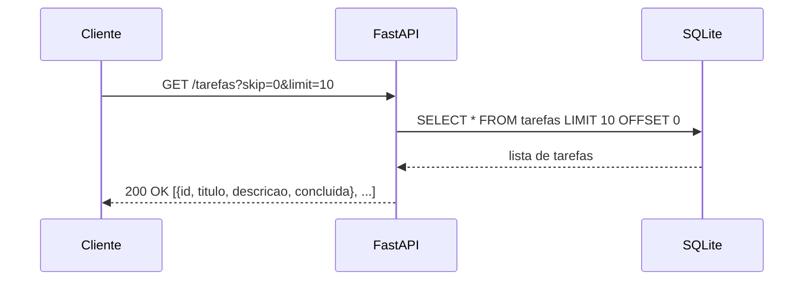
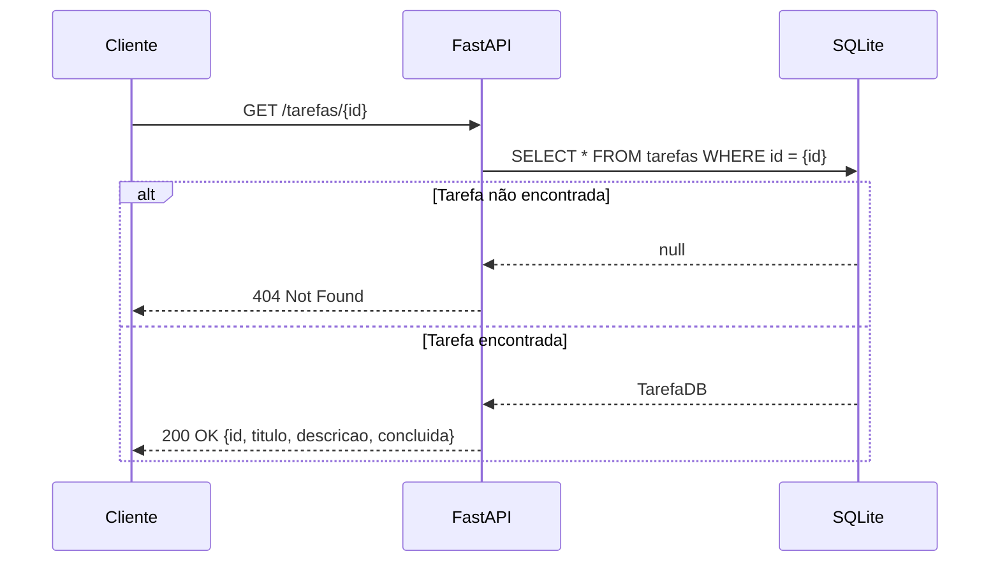
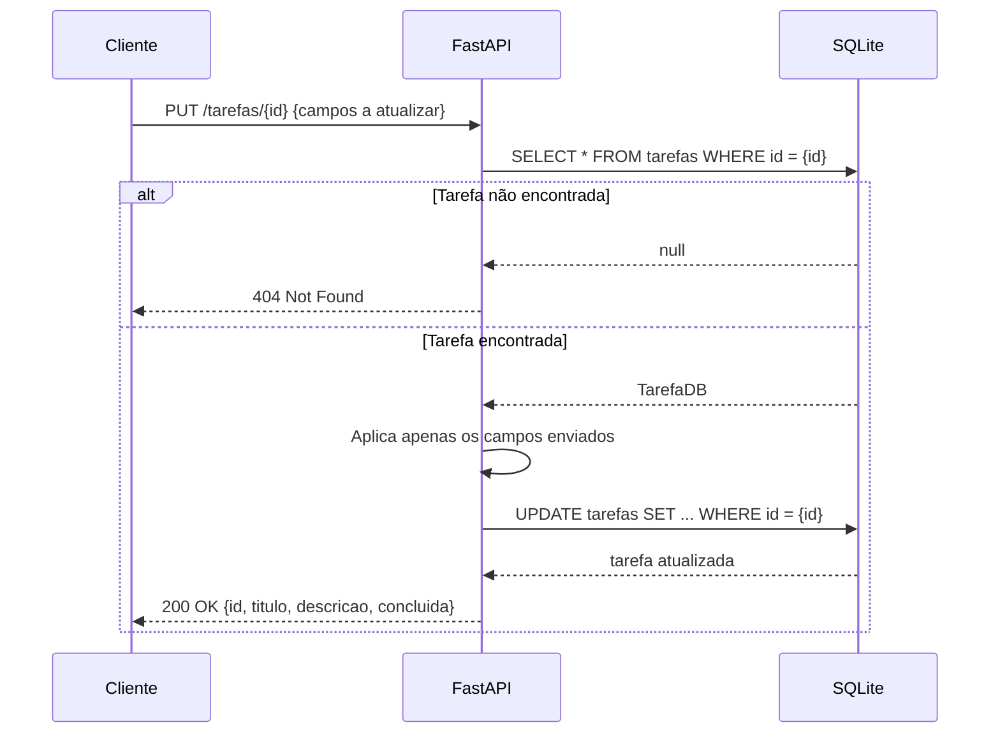
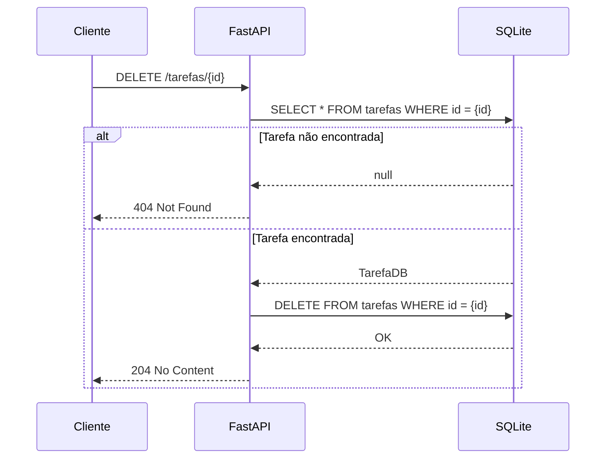

# Documentação Técnica — API de Tarefas

## 1. Visão Geral

API REST para gerenciamento de tarefas, construída com **FastAPI** e persistência em **SQLite** via **SQLAlchemy**. Permite criar, listar, buscar, atualizar e remover tarefas através de endpoints HTTP com validação automática de dados.

---

## 2. Requisitos de Negócio

| ID   | Descrição |
|------|-----------|
| RN01 | O sistema deve permitir o controle de tarefas por qualquer cliente HTTP. |
| RN02 | Cada tarefa deve possuir título, descrição e estado de conclusão. |
| RN03 | O estado de uma tarefa deve poder ser alterado sem que outros campos precisem ser reenviados. |
| RN04 | As tarefas devem ser persistidas entre sessões (reinicializações do servidor). |
| RN05 | O sistema deve retornar mensagens de erro claras quando uma tarefa não for encontrada ou os dados forem inválidos. |

---

## 3. Requisitos Funcionais

| ID   | Descrição |
|------|-----------|
| RF01 | O sistema deve permitir a criação de uma tarefa com título (obrigatório), descrição (obrigatória) e status de conclusão (opcional, padrão `false`). |
| RF02 | O sistema deve listar todas as tarefas cadastradas com suporte a paginação via parâmetros `skip` e `limit`. |
| RF03 | O sistema deve permitir buscar uma tarefa pelo seu identificador único. |
| RF04 | O sistema deve permitir a atualização parcial de uma tarefa — somente os campos enviados devem ser modificados. |
| RF05 | O sistema deve permitir a remoção de uma tarefa pelo seu identificador único. |

---

## 4. Requisitos Não Funcionais

| ID    | Categoria       | Descrição |
|-------|-----------------|-----------|
| RNF01 | Padrão          | A API deve seguir o padrão REST com verbos HTTP semânticos (GET, POST, PUT, DELETE). |
| RNF02 | Persistência    | Os dados devem ser armazenados em banco relacional SQLite via ORM SQLAlchemy. |
| RNF03 | Documentação    | A API deve gerar documentação interativa automática via OpenAPI (disponível em `/docs`). |
| RNF04 | Validação       | Todos os dados de entrada devem ser validados automaticamente via Pydantic, com retorno de erro 422 para dados inválidos. |
| RNF05 | Testabilidade   | A aplicação deve possuir testes automatizados de integração cobrindo todos os endpoints. |
| RNF06 | Status HTTP     | A API deve retornar status HTTP semânticos: `201` na criação, `204` na exclusão, `404` para recurso não encontrado, `422` para dados inválidos. |
| RNF07 | Manutenibilidade | O código deve ser organizado em camadas separadas: rotas, modelos e banco de dados. |

---

## 5. Modelo de Dados

### Entidade: `Tarefa`

| Campo      | Tipo    | Obrigatório | Padrão  | Descrição                        |
|------------|---------|-------------|---------|----------------------------------|
| `id`       | inteiro | —           | Auto    | Identificador único (gerado pelo banco). |
| `titulo`   | string  | Sim         | —       | Título descritivo da tarefa.     |
| `descricao`| string  | Sim         | —       | Detalhamento da tarefa.          |
| `concluida`| boolean | Não         | `false` | Indica se a tarefa foi concluída.|

### Schemas de entrada/saída

| Schema         | Uso          | Campos obrigatórios     |
|----------------|--------------|-------------------------|
| `TarefaCreate` | POST         | `titulo`, `descricao`   |
| `TarefaUpdate` | PUT          | Nenhum (todos opcionais)|
| `Tarefa`       | Resposta     | Todos (inclui `id`)     |

---

## 6. Endpoints

| Método   | Rota               | Descrição                        | Status de sucesso |
|----------|--------------------|----------------------------------|-------------------|
| `GET`    | `/tarefas`         | Lista tarefas com paginação      | `200 OK`          |
| `GET`    | `/tarefas/{id}`    | Retorna uma tarefa pelo ID       | `200 OK`          |
| `POST`   | `/tarefas`         | Cria uma nova tarefa             | `201 Created`     |
| `PUT`    | `/tarefas/{id}`    | Atualiza parcialmente uma tarefa | `200 OK`          |
| `DELETE` | `/tarefas/{id}`    | Remove uma tarefa                | `204 No Content`  |

### Parâmetros de paginação (GET /tarefas)

| Parâmetro | Tipo    | Padrão | Descrição                          |
|-----------|---------|--------|------------------------------------|
| `skip`    | inteiro | `0`    | Número de registros a pular.       |
| `limit`   | inteiro | `10`   | Número máximo de registros a retornar. |

---

## 7. Exceções e Códigos de Resposta

| Código | Nome                    | Quando ocorre                                                      |
|--------|-------------------------|--------------------------------------------------------------------|
| `200`  | OK                      | GET e PUT bem-sucedidos.                                           |
| `201`  | Created                 | POST bem-sucedido — tarefa criada.                                 |
| `204`  | No Content              | DELETE bem-sucedido — tarefa removida.                             |
| `404`  | Not Found               | GET, PUT ou DELETE com ID inexistente no banco.                    |
| `422`  | Unprocessable Entity    | Corpo da requisição com campos obrigatórios ausentes ou tipo errado.|
| `500`  | Internal Server Error   | Falha inesperada no servidor (ex: erro de banco de dados).         |

### Exemplos de resposta de erro

**404 Not Found**
```json
{
  "detail": "Tarefa não encontrada"
}
```

**422 Unprocessable Entity**
```json
{
  "detail": [
    {
      "type": "missing",
      "loc": ["body", "titulo"],
      "msg": "Field required"
    }
  ]
}
```

---

## 8. Diagramas

### 8.1 Arquitetura do Sistema



---

### 8.2 Ciclo de Vida da Tarefa



---

### 8.3 Sequência — POST /tarefas (Criar tarefa)



---

### 8.4 Sequência — GET /tarefas (Listar tarefas)



---

### 8.5 Sequência — GET /tarefas/{id} (Buscar por ID)



---

### 8.6 Sequência — PUT /tarefas/{id} (Atualizar tarefa)



---

### 8.7 Sequência — DELETE /tarefas/{id} (Remover tarefa)



---

## 9. Estrutura do Projeto

```
api-pratica-ia/
├── app/
│   ├── main.py        # Definição das rotas e lógica dos endpoints
│   ├── models.py      # Modelos ORM (SQLAlchemy) e schemas (Pydantic)
│   └── database.py    # Configuração do engine, sessão e Base do SQLAlchemy
├── tests/
│   └── test_api.py    # Testes de integração com banco em memória
├── docs/
│   └── DOCUMENTACAO.md
├── requirements.txt
├── README.md
└── tarefas.db         # Banco SQLite gerado automaticamente na execução
```

---

## 10. Dependências

| Pacote       | Versão   | Finalidade                              |
|--------------|----------|-----------------------------------------|
| fastapi      | 0.111.0  | Framework web para construção da API    |
| uvicorn      | 0.29.0   | Servidor ASGI para execução da API      |
| sqlalchemy   | 2.0.30   | ORM para persistência em banco de dados |
| pydantic     | 2.7.1    | Validação e serialização de dados       |
| pytest       | 8.2.0    | Framework de testes                     |
| httpx        | 0.27.0   | Cliente HTTP usado pelo TestClient      |
